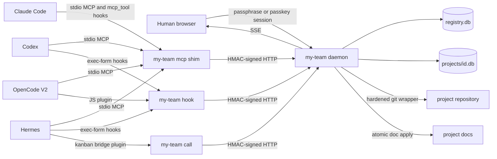

# my-team — Architecture

| Field | Value |
|---|---|
| Version | 1.0 |
| Last updated | 2026-09-23 |
| Status | Approved |

## Overview

my-team runs entirely on the developer's machine. The design rests on one division of responsibility: **the daemon
holds state and the agents hold intelligence.** The daemon never calls a language model and never starts an agent
process. Drafting documents, triaging audit findings, and judging duplication all happen inside agent sessions. The
daemon provides:

- deterministic storage
- validation
- repository scanning
- enforcement of ownership and approval rules
- the human control surface

**Boundaries.** Everything listens on loopback only. One daemon runs per OS user. Each project gets its own SQLite
file in the user data directory. The only files written inside a project repository are `.my-team/project.toml`
(identity, written once) and the mapped documentation files.

**Components.**
- **Skill** (`skills/my-team/`): all behaviour text, meaning rules, command procedures, document templates, and the
  review protocol.
- **Adapters:** packaging that maps the skill, hooks, and MCP configuration onto each agent's native format.
  Adapters contain no behaviour text.
- **MCP shim** (`my-team mcp`): one stdio process per agent session. Exposes 12 tools, attaches notices to every
  result, and heartbeats to the daemon.
- **Hook handler** (`my-team hook`): standard library only, run as `python -I -S`, for agents whose hooks must
  spawn a process.
- **Scanner** (`my-team scan`): read-only and deterministic, run as a separate process with a timeout.
- **Daemon** (`my-team serve`): FastAPI on loopback, the only writer to SQLite. Serves REST, SSE, and the dashboard.
- **Dashboard:** a prebuilt React application served by the daemon.

## High-Level Architecture

**Data flow: assigning a ticket.**
1. The human assigns ticket MT-7 to an agent seat. The ticket is now *pending pickup*.
2. At that agent's next prompt (hook) or tool call (MCP notice), the agent is told about the assignment.
3. It asks the human, or proceeds if the prompt says so.
4. It calls `ticket_claim`. A single conditional UPDATE makes it the holder.
5. The UI updates over SSE: "In progress · reported Ns ago".
6. If no session picks the ticket up, the UI keeps showing "pending pickup". It never shows "working".

## Technology Stack

| Layer | Technology | Purpose |
|---|---|---|
| Daemon | Python ≥3.11, FastAPI, uvicorn, Pydantic v2 | REST API, SSE, auth, static UI hosting on loopback |
| Storage | SQLite (WAL, one writer thread per project DB), FTS5 | Registry, per-project state, full-text memory search |
| Agent protocol | MCP over stdio (official `mcp` Python SDK) | Tools, notices, and prompts for all four agents |
| Hooks | Claude Code `mcp_tool` hooks; stdlib Python exec-form hooks elsewhere | Context injection and the pre-edit guard |
| Frontend | React 19, Vite, TypeScript strict, Tailwind v4, Radix primitives, lucide | Human dashboard, built once and shipped inside the wheel |
| Realtime | Server-Sent Events backed by an append-only event log | Live dashboard with replay after reconnect |
| Auth | scrypt passphrase, optional WebAuthn passkey, HMAC-signed agent requests | Human sessions that agents cannot obtain; secret never sent over the socket |
| Packaging | PyPI `my-team-agents` (command `my-team`), Claude Code plugin marketplace, per-agent installers | Distribution |
| Testing | pytest, MCP Python client, Vitest, Playwright, LLM evaluation harness | Verification on Windows, macOS, and Linux |

No Docker, administrator rights, or OS service is required.

## Folder Structure

Current (S0) and planned layout. Directories marked *planned* are created in the slice named.

| Path | Purpose |
|---|---|
| `.claude-plugin/`, `.codex-plugin/`, `.agents/plugins/` | Plugin manifests and marketplaces *(planned: S1, S5)* |
| `skills/my-team/` | The skill: `SKILL.md`, `references/`, `templates/` *(planned: S1)* |
| `commands/` | Claude Code entry points for `/my-team:*` *(planned: S1)* |
| `hooks/`, `.mcp.json` | Claude Code hook and MCP wiring *(planned: S1)* |
| `adapters/` | OpenCode plugin and Hermes templates rendered by `my-team install` *(planned: S5)* |
| `server/` | Python package `my_team`: CLI, daemon, domain services, MCP shim, scanner, tests |
| `ui/` | Dashboard source *(planned: S1)* |
| `docs/` | These five documents; installation and agent-integration guides come in S6 |
| `.my-team/` | This repository's own project identity (dogfooding) |
| `.github/workflows/` | CI matrix: Windows, macOS, and Linux |

Inside `server/src/my_team/`, each domain is one module that combines service and repository. Routers stay thin.
Every operation is declared once in `ops.py`, and the REST routes, MCP tools, and `my-team call` are generated from
that table.

## Integrations

Agent capabilities were verified against the installed versions on 2026-09-22/23. Adapters detect capabilities at
runtime and never assume parity between agents.

| | Claude Code 2.1.280 | Codex 0.155.1 | OpenCode V2 2.0.13 | Hermes 0.21.4 |
|---|---|---|---|---|
| Commands | `/my-team:init` (plugin command) | `$my-team init` (no custom slash commands exist) | `/my-team:init` (MCP prompt) | `/my-team init` (skill slug) |
| Context injection | One SessionStart command hook (first turn), then `mcp_tool` hooks to the shim per prompt *(verified S1)* | SessionStart/UserPromptSubmit exec-form hooks; need one-time trust in `/hooks` | JS plugin `context` and `prompt` hooks | `pre_llm_call` shell hook, after consent |
| Session id | Hook `session_id`; shim env `CLAUDE_CODE_SESSION_ID`; lineage via the `claude.exe` ancestor *(verified S0)* | `_meta.threadId` on each call | `_meta.sessionID` on each call | Tool argument, from `${HERMES_SESSION_ID}` |
| Live push | Deferred | Not possible | Deferred | Deferred |

Hermes's kanban board is bridged both ways. my-team owns ticket status, assignment, and claims, and Hermes tasks
are projections of that state.

**Measured on Windows (S0).**
- Python hook cold start is p95 200–233 ms with `-I -S` and a raw-socket request, versus about 1 s when run through
  Git Bash.
- Therefore command hooks always run in exec form and never through a shell.
